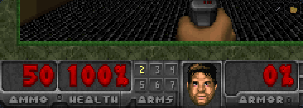
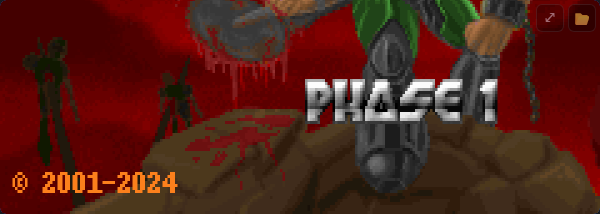

# Goom — a Grafana panel that plays the classic id Tech 1 engine

> **Plugin ID:** `itbaer-goom-panel` &nbsp;·&nbsp; **Type:** panel &nbsp;·&nbsp; **License:** GPL-3.0-or-later

Add a panel to any Grafana dashboard and play a classic first-person shooter
right there, in the browser, inside the panel. The panel ships with
[**Freedoom**](https://freedoom.github.io/) so it plays **instantly** — no
configuration, no uploads. Bring your own IWAD/PWAD if you want to run a
different game.





## Features

- ▶️ **Zero-click play.** Add the panel; Freedoom boots in seconds.
- 🕹 **id Tech 1 engine** via the [`cloudflare/doom-wasm`](https://github.com/cloudflare/doom-wasm)
  WebAssembly build of [chocolate-doom](https://github.com/chocolate-doom/chocolate-doom).
- 💾 **Bring your own WAD.** Drag-drop upload or paste a URL — cached in the
  browser via IndexedDB. Works with user-supplied DOOM®, DOOM II®, Final DOOM,
  and community PWADs.
- 🔊 Browser-compliant audio unlock (click once to enable sound).
- ⌨️ Focus-based keyboard capture — dashboard shortcuts stay yours until the
  panel has focus.
- 📺 Fullscreen, pause, mute, reset from the HUD overlay.
- 🧩 Panel-only, no backend, no outbound telemetry.

## Install

*(Catalog listing coming — see [PLAN.md](./PLAN.md) §8.)*

From a release ZIP:

```bash
grafana-cli --pluginUrl https://github.com/IT-BAER/itbaer-goom-panel/releases/download/vX.Y.Z/itbaer-goom-panel-X.Y.Z.zip plugins install itbaer-goom-panel
```

## Use

1. Add a new panel to any dashboard.
2. Choose **Goom** as the visualization.
3. Freedoom starts automatically. Click the canvas to enable sound and
   capture keyboard input.

### Loading your own WAD

Click the **⚙** in the HUD overlay → **WAD** tab:

- Drop a `.wad` file onto the zone, or
- Paste a URL (HTTP/HTTPS only), or
- Click **Use bundled Freedoom** to revert.

WADs are cached per-browser in IndexedDB. They never leave your browser unless
you paste an external URL.

### Controls (default — WASD preset)

| Action         | Keys                              |
| -------------- | --------------------------------- |
| Move           | `W` `A` `S` `D`                   |
| Look           | Mouse                             |
| Fire           | Left-click                        |
| Use / open     | `E` / Space                       |
| Weapon switch  | `1`–`7` / mouse wheel             |
| Menu           | Backspace                         |
| Pause panel    | `P`                               |
| Release focus  | `Esc`                             |

A **Vanilla** control preset (arrow keys + Ctrl) is available in panel options.

## Development

Canonical engineering rules:
[grafana-mp/CONVENTIONS.md](https://github.com/IT-BAER/grafana-mp/blob/main/CONVENTIONS.md).

```bash
npm install
npm run dev            # watch build
docker compose up      # Grafana at http://localhost:3000  (admin/admin)
```

The WebAssembly engine (`src/wasm/doom.js` + `doom.wasm`) and the bundled
Freedoom WAD (`src/public/wads/freedoom1.wad`) are **not** committed. They are
fetched/built by:

```bash
npm run fetch:freedoom     # downloads + verifies freedoom1.wad
npm run build:wasm         # requires emsdk; builds cloudflare/doom-wasm
```

CI produces these artifacts on release. See [PLAN.md](./PLAN.md) for the full
implementation plan.

## License & attribution

This plugin is released under **GPL-3.0-or-later** — see [LICENSE](./LICENSE).

This is required because the plugin embeds the id Tech 1 engine source code,
which id Software released under GPL-2.0-or-later on 1999-10-03. Detailed
third-party attributions (chocolate-doom, cloudflare/doom-wasm, Freedoom) are
in [NOTICE](./NOTICE).

### Trademarks — important

Goom is an **independent, unofficial** community plugin.

- DOOM® is a registered trademark of ZeniMax Media Inc., owned by Microsoft
  Corporation. Goom is **not** affiliated with, authorized by, endorsed by, or
  in any way connected to id Software, Bethesda Softworks, ZeniMax Media, or
  Microsoft Corporation. No DOOM® sprites, logos, or audio are bundled with
  this plugin.
- Grafana® is a registered trademark of Raintank, Inc. (d/b/a Grafana Labs).
  Goom is an unofficial community plugin and is not affiliated with Grafana
  Labs.

References to DOOM® in this documentation are strictly nominative and
descriptive: the plugin is compatible with user-supplied DOOM® WAD files via
the open-source id Tech 1 engine source code (GPL-2.0-or-later).

## Security

See [SECURITY.md](./SECURITY.md) for the vulnerability reporting policy.

## Contributing

See [CONTRIBUTING.md](./CONTRIBUTING.md). Conventional Commits required.
# Grafana panel plugin template

This template is a starting point for building a panel plugin for Grafana.

## What are Grafana panel plugins?

Panel plugins allow you to add new types of visualizations to your dashboard, such as maps, clocks, pie charts, lists, and more.

Use panel plugins when you want to do things like visualize data returned by data source queries, navigate between dashboards, or control external systems (such as smart home devices).

## Getting started

### Frontend

1. Install dependencies

   ```bash
   npm install
   ```

2. Build plugin in development mode and run in watch mode

   ```bash
   npm run dev
   ```

3. Build plugin in production mode

   ```bash
   npm run build
   ```

4. Run the tests (using Jest)

   ```bash
   # Runs the tests and watches for changes, requires git init first
   npm run test

   # Exits after running all the tests
   npm run test:ci
   ```

5. Spin up a Grafana instance and run the plugin inside it (using Docker)

   ```bash
   npm run server
   ```

6. Run the E2E tests (using Playwright)

   ```bash
   # Spins up a Grafana instance first that we tests against
   npm run server

   # If you wish to start a certain Grafana version. If not specified will use latest by default
   GRAFANA_VERSION=11.3.0 npm run server

   # Starts the tests
   npm run e2e
   ```

7. Run the linter

   ```bash
   npm run lint

   # or

   npm run lint:fix
   ```

# Distributing your plugin

When distributing a Grafana plugin either within the community or privately the plugin must be signed so the Grafana application can verify its authenticity. This can be done with the `@grafana/sign-plugin` package.

_Note: It's not necessary to sign a plugin during development. The docker development environment that is scaffolded with `@grafana/create-plugin` caters for running the plugin without a signature._

## Initial steps

Before signing a plugin please read the Grafana [plugin publishing and signing criteria](https://grafana.com/legal/plugins/#plugin-publishing-and-signing-criteria) documentation carefully.

`@grafana/create-plugin` has added the necessary commands and workflows to make signing and distributing a plugin via the grafana plugins catalog as straightforward as possible.

Before signing a plugin for the first time please consult the Grafana [plugin signature levels](https://grafana.com/legal/plugins/#what-are-the-different-classifications-of-plugins) documentation to understand the differences between the types of signature level.

1. Create a [Grafana Cloud account](https://grafana.com/signup).
2. Make sure that the first part of the plugin ID matches the slug of your Grafana Cloud account.
   - _You can find the plugin ID in the `plugin.json` file inside your plugin directory. For example, if your account slug is `acmecorp`, you need to prefix the plugin ID with `acmecorp-`._
3. Create a Grafana Cloud API key with the `PluginPublisher` role.
4. Keep a record of this API key as it will be required for signing a plugin

## Signing a plugin

### Using Github actions release workflow

If the plugin is using the github actions supplied with `@grafana/create-plugin` signing a plugin is included out of the box. The [release workflow](./.github/workflows/release.yml) can prepare everything to make submitting your plugin to Grafana as easy as possible. Before being able to sign the plugin however a secret needs adding to the Github repository.

1. Please navigate to "settings > secrets > actions" within your repo to create secrets.
2. Click "New repository secret"
3. Name the secret "GRAFANA_API_KEY"
4. Paste your Grafana Cloud API key in the Secret field
5. Click "Add secret"

#### Push a version tag

To trigger the workflow we need to push a version tag to github. This can be achieved with the following steps:

1. Run `npm version <major|minor|patch>`
2. Run `git push origin main --follow-tags`

## Learn more

Below you can find source code for existing app plugins and other related documentation.

- [Basic panel plugin example](https://github.com/grafana/grafana-plugin-examples/tree/master/examples/panel-basic#readme)
- [`plugin.json` documentation](https://grafana.com/developers/plugin-tools/reference/plugin-json)
- [How to sign a plugin?](https://grafana.com/developers/plugin-tools/publish-a-plugin/sign-a-plugin)
