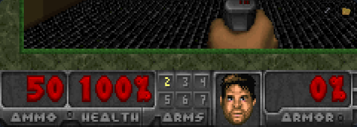
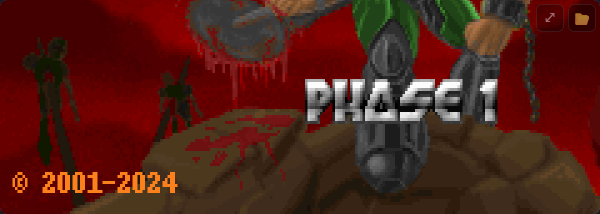

# Goom: a Grafana panel that plays the classic id Tech 1 engine

> **Plugin ID:** `itbaer-goom-panel` &nbsp;·&nbsp; **Type:** panel &nbsp;·&nbsp; **License:** GPL-3.0-or-later

Add Goom to any Grafana dashboard and play a first-person shooter inside the
panel. It ships with [Freedoom](https://freedoom.github.io/), so a fresh panel
boots straight into a playable game. Point it at your own IWAD or PWAD to run
something else.





## Features

- ▶️ **Boots on add.** Drop the panel on a dashboard and Freedoom starts within
  a few seconds.
- 🕹 **id Tech 1 engine** via the [`cloudflare/doom-wasm`](https://github.com/cloudflare/doom-wasm)
  WebAssembly build of [chocolate-doom](https://github.com/chocolate-doom/chocolate-doom).
- 💾 **Bring your own WAD.** Upload a file from the panel HUD or point the panel
  at a URL. Uploads live in that browser's IndexedDB and go nowhere else. Works
  with user-supplied DOOM®, DOOM II®, Final DOOM, and community PWADs.
- ⌨️ **Focus-based keyboard capture.** Your dashboard shortcuts keep working
  until you click into the panel.
- 📺 **Fullscreen toggle** in the HUD overlay. Pause with `P` while playing.
- 🔊 **Audio** follows the `Mute on load` panel option, applied the next time the
  engine boots.
- 🧩 **Frontend only.** The plugin ships no backend process and sends no
  telemetry.

## Install

*(Catalog listing coming, see [PLAN.md](./PLAN.md) §8.)*

From a release ZIP:

```bash
grafana-cli --pluginUrl https://github.com/IT-BAER/itbaer-goom-panel/releases/download/vX.Y.Z/itbaer-goom-panel-X.Y.Z.zip plugins install itbaer-goom-panel
```

## Use

1. Add a new panel to any dashboard.
2. Choose **Goom** as the visualization.
3. Freedoom starts on its own. Click the canvas to capture keyboard input.

### Loading your own WAD

Two routes:

- Click **📂** in the HUD overlay and pick a `.wad` file. It is cached in this
  browser via IndexedDB.
- Set **WAD source** to a URL in panel options and paste an HTTP or HTTPS
  address.

Set **WAD source** back to Freedoom to return to the bundled game. An uploaded
WAD stays in your browser; a URL is fetched from wherever you point it.

### Controls (default: WASD preset)

| Action         | Keys                              |
| -------------- | --------------------------------- |
| Move           | `W` `A` `S` `D`                   |
| Look           | Mouse                             |
| Fire           | Left-click                        |
| Use / open     | `E` / Space                       |
| Weapon switch  | `1`–`7` / mouse wheel             |
| Menu           | Backspace                         |
| Pause panel    | `P`                               |
| Release focus  | `Esc`                             |

Panel options also carry a **Vanilla** preset using arrow keys and Ctrl.

## Development

Canonical engineering rules:
[grafana-mp/CONVENTIONS.md](https://github.com/IT-BAER/grafana-mp/blob/main/CONVENTIONS.md).

```bash
npm install
npm run dev            # watch build
docker compose up      # Grafana at http://localhost:3000  (admin/admin)
npm run test:ci        # unit tests
npm run e2e            # Playwright, needs Grafana running
npm run lint           # add :fix to apply
```

The WebAssembly engine (`src/wasm/doom.js` and `doom.wasm`) and the bundled
Freedoom WAD (`src/public/wads/freedoom1.wad`) stay out of git. Fetch and build
them with:

```bash
npm run fetch:freedoom     # downloads and verifies freedoom1.wad
npm run build:wasm         # requires emsdk; builds cloudflare/doom-wasm
```

CI produces both artifacts on release. [PLAN.md](./PLAN.md) carries the full
implementation plan.

## License and attribution

This plugin is released under **GPL-3.0-or-later**, see [LICENSE](./LICENSE).

The license is required because the plugin embeds the id Tech 1 engine source
code, which id Software released under GPL-2.0-or-later on 1999-10-03.
[NOTICE](./NOTICE) carries the detailed third-party attributions for
chocolate-doom, cloudflare/doom-wasm, and Freedoom.

### Trademarks

Goom is an **independent, unofficial** community plugin.

- DOOM® is a registered trademark of ZeniMax Media Inc., owned by Microsoft
  Corporation. Goom is **not** affiliated with, authorized by, endorsed by, or
  in any way connected to id Software, Bethesda Softworks, ZeniMax Media, or
  Microsoft Corporation. No DOOM® sprites, logos, or audio are bundled with
  this plugin.
- Grafana® is a registered trademark of Raintank, Inc. (d/b/a Grafana Labs).
  Goom is an unofficial community plugin and is not affiliated with Grafana
  Labs.

References to DOOM® in this documentation are strictly nominative and
descriptive: the plugin is compatible with user-supplied DOOM® WAD files via
the open-source id Tech 1 engine source code (GPL-2.0-or-later).

## Security

[SECURITY.md](./SECURITY.md) carries the vulnerability reporting policy.

## Contributing

See [CONTRIBUTING.md](./CONTRIBUTING.md). Conventional Commits required.
